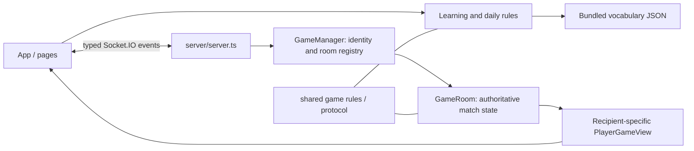

# Architecture

## Runtime and entry points

Penjat is a React 19/Vite 8 TypeScript SPA and a Node HTTP service with Socket.IO 4. There is no Express, router library, database, global state library or runtime vocabulary API. `src/main.tsx` mounts `App` in StrictMode. `src/routing.ts` normalizes paths; `App.tsx` manages browser history, modes, interface/game language, room snapshots, chat, the site header/footer and guarded exits. Routes: `/`, `/multijugador/`, `/aprendre/`, `/paraula-del-dia/`, `/com-es-juga/`.

`server/server.ts` serves `dist/`, route-specific SEO metadata, legacy Spanish redirects, `/health`, room previews at `/api/rooms/:code/preview`, and Socket.IO. Development uses Vite plus the separate server; production serves both on one origin. There is no service worker or backend persistence. `render.yaml`, README and package scripts describe single-process hosting; deployment is outside routine verification.

## Ownership and boundaries

| State | Owner | Lifetime |
| --- | --- | --- |
| Learning round, attempt history, summary | `LearningPage`, pure `learning/game.ts` rules | Mounted page only |
| Daily round | `DailyChallengePage`, `daily/game.ts` | Replayed from local storage for current Madrid date |
| Homepage daily summary (number, won/lost, mistakes) | `HomePage`, pure `daily/homeSummary.ts` | Re-read on mount, focus, storage events and each minute; never shows the word |
| Match, score, turn roster, forgiveness, secret word | `GameRoom` | Server process / room |
| Identity → room/socket mappings | `GameManager` | Server process |
| Disconnect timers | `server.ts` | 25 seconds after socket loss |
| Room view, chat display, typing display | `App` | Current client |
| Name, languages, selected learning level | `localStorage` | Browser origin |
| Room code/player ID/reconnect token | `sessionStorage` | Tab session (can be copied by browser tab duplication/opener) |

Clients send intent (`game:guess`, `round:set-word`, etc.). Server resolves socket identity, validates, mutates `GameRoom`, acknowledges and broadcasts individually serialized `viewFor(playerId)` snapshots. Guessers never receive the active secret word or other players' private progress; setter observation receives a selected board and setter-only forgiveness requests. Chat uses separate events and a bounded in-memory history of 50 messages. Completion retains the room for rematches; explicit departure or expired reconnect grace removes membership, deleting the room when no active members remain.

## Vocabulary and local game logic

`learning/vocabulary.ts` validates the bundled 544-entry `data/vocabulary.json`. `learning/game.ts` filters CEFR metadata: basic=A1/A2, intermediate=B1/B2, advanced=C1/C2, all=classified entries. The legacy `difficulty` field is distinct. Selection favors unseen words, permits failed-word review after a cooldown and falls back within the selected pool. Daily mode resolves a fixed 32-ID ordered pool against the same dataset; day index from the Madrid date and fixed epoch selects the word.

The offline Python pipeline is in `scripts/vocab_pipeline.py`, with small command wrappers. Source/license and review provenance live in `data/README.md`; approved baseline is `docs/vocabulary-v1.md`. Experiments under `data/experiments/` are ignored and must not become runtime dependencies. Reviewed metadata is merged by stable ID using `data/review/linguistic-metadata.json`. Ordinary builds never call external APIs.

`shared/game.ts` is the active shared normalization/matching implementation. Older `src/game/game.ts` and word lists remain; inspect callers before reusing them. Learning and daily rules are similar but have different session/persistence lifecycles.

## Styling and typography

Plain CSS: `src/index.css` holds the font faces and shared tokens, and `src/App.css` holds component rules. There is no CSS framework.

- **Fonts.** `--font-display` (self-hosted Fraunces, with Georgia/serif fallbacks) is for the brand, expressive headings, game words and outcomes. `--font-ui` is for body text, controls, names, chat, scores and functional panel titles. It is *Penjat UI*, a self-hosted 30.6 kB WOFF2 subset of Source Sans 3 (OFL, renamed because of the Reserved Font Name; see `src/assets/fonts/README.md`), with metric-matched Arial/Helvetica fallback faces in regular and bold (with `font-synthesis: none`, a regular-only fallback would flatten all semibold/bold text if the web font fails). The build preloads the hashed font (`vite.config.ts`).
- **Identity.** The exact Lovable OKLCH paper/ink/magrana/saffron/teal/olive palette and contrast-tested semantic roles (including `--mar-surface`/`--oliva-surface` tints) live in `index.css`. Buttons and major cards use Lovable's printed treatment: 2px ink outlines and 3px (phones) / 4px offset shadows that lift on hover and press in on click (no movement with reduced motion). Segmented choices and the selected option are inked; supporting panels (help sections, history rows) keep outlines without shadows. Display headings use `--text-hero`/`--text-display`/`--text-section`/`--text-card-title` and an italic accent word (`<em>`, slant synthesised only there because Fraunces ships one upright face). Labels are sentence case, not small uppercase. The shared `HangmanDrawing` has explicit six-error body parts, hat/head and scarf/torso pairs, a rescued victory pose and a quiet defeat expression. Adjacent translated counts/outcomes make game/result drawings decorative. Only newly revealed parts animate, with reduced-motion support.
- **Site shell (Phase 3B).** `SiteHeader` replaces the old floating back button and language toggle: wordmark link, the four routed sections (`navigation/links.ts`, `aria-current` on the current one), a contextual exit (`.global-back-button`: leave the room/match, end the learning session) and the CA/ES pill. From 1000px the sections are inline; below, a disclosure button opens an overlay menu (no layout shift) with Inici, the sections and the interface language. It closes on Escape (focus returns to the button), an outside pointer press, focus leaving the header, navigation, and growing past 1000px. Below 384px a contextual exit replaces the header language pill (still in the menu). The header scrolls with the page; it is sticky only on large content pages (home, help, multiplayer setup ≥1000×600). `App.navigate` guards header links: leaving a waiting room or an active match, or an unfinished learning/daily game, asks first (`ExitConfirmationDialog` has `game` and `room` copy). A skip link focuses `<main>`. `SiteFooter` (ink band with the section links) closes the home, help and setup pages. Page heads (`.page-head`: colour eyebrow, Fraunces heading, lede) replace the per-page brand marks.
- **Phone homepage hero (Phase 3C).** At ≤599px (37.4375em, so enlarged text also gets it) the hero is a single column: eyebrow, `<h1>` and lede, then the character drawing and letter slots without the preview card frame, then `.home-quick`. That nav repeats the `.home-modes` destinations in a new order: a full-width ~104px magrana **Jugar** link (`/multijugador`, the existing main action; there is no separate solo mode) and two equal 68px cards, *Aprèn català* and *Paraula del dia*, with the challenge number and a ✓ once played. Phones hide `.home-modes`, and wider screens hide `.home-quick`, so only one of the two is ever rendered or focusable. The tablet and desktop hero are unchanged. Below 375px the card icons lose their circles. Below 360px the drawing shrinks and the Jugar arrow is hidden. Below 320 CSS px the cards stack and Jugar centres its content.
- **Multiplayer setup (Phase 3C).** The name comes first because both paths need it, and it is the page's main element.
  - **Name card.** A saffron card with an inked "1" step badge and a Fraunces title (`--text-card-title`), above a large display-font field and a hint (`aria-describedby`). On desktop (≥1000px) the title sits beside the field; on narrower screens the field sits below it.
  - **Step 2.** A lighter "2 · Després, tria com jugar" line introduces the create and join panels. Their titles are smaller (`--text-panel-title`) and their shadows lighter.
  - **Phones (≤599px, via `matchMedia` in `HomePage`).** Each panel heading becomes a disclosure button (`aria-expanded`/`aria-controls`) and only one panel is open at a time. A collapsed card is fully clickable. Panel bodies use `hidden`.
  - **Wider screens.** Both panels render open, with plain `<h2>` headings and no extra controls.
- **Type scale.** Semantic rem tokens (`--text-body`, `-control`, `-name`, `-chat`, `-meta`, `-label`, `-panel-title`, `-page-title`, `-outcome`, `-score`, `-lede`) take phone values, then step up at 661px (body 17px) and 1200px (body 18px, metadata 15px). Use the tokens rather than literal sizes. The root font size stays at the browser default, so user text settings apply.
- **Breakpoints** are written in em (px ÷ 16), so a larger default text size switches to the narrower layouts. Sidebar and column widths are capped with viewport-relative `min()` so enlarged text never squeezes the board.
- **Gameplay shell.** Three columns (ranking · board · forgiveness/chat) from 1300px. From 1000–1299px the board stays wide, with ranking and chat in a 18.5rem sidebar. At 999px and below everything stacks, the same boundary as the match results, in DOM order: forgiveness tray, board, ranking, chat. The ranking follows the board in the DOM at every width; beside the board the grid area places it in its own column. Grid rows have no row gap, so an absent forgiveness tray never offsets the other cards. An empty chat (`.room-chat.is-empty`) is a compact card rather than a full-height column.
- **Compact live ranking.** `Scoreboard` (helper `src/multiplayer/liveRanking.ts`) renders the full list plus, from four participants, a summary (leaders by name up to two, otherwise a tie count; the player's own place, marked as tied when shared) and a native disclosure button (`aria-expanded`/`aria-controls`). CSS shows the summary and button only in the stacked layout; beside the board the full list is always visible. The expanded state is component state, so live `room:state` updates never collapse it. The final match classification (Phase 2A) is unaffected.
- **Completed words.** Learning and daily results share one presentation: a small drawing beside the outcome and the mistake count, the Catalan word once as a Fraunces heading (focused with `tabIndex=-1` when the round ends in this visit), then definition/example or definition/translation. The tiles and the drawing column are not rendered after completion. From 900px the learning card uses two columns so “next word” stays near the top.
- No global `min-width`: below 320 CSS px (zoomed phones) pages keep reflowing. Only word strips scroll horizontally.

## Persistence and limits

Daily storage (`penjat-daily-challenge`) stores one date's guesses/result; restore (including the homepage summary) reconstructs the round from guesses, not trusted score flags. Learning history/stats are not persisted; `penjat-learning-cefr` is a preference only. Interface preference is separate from `hangman-game-language`; multiplayer name uses `hangman-name`. Room credentials use `hangman-room-session` in session storage. No accounts or cross-device saves exist. Restarting the server loses all rooms; multiple replicas cannot share state.

## Incremental concerns

- `App` combines routing, socket subscriptions, restoration and metadata. Extract a small session coordinator only when further lifecycle work requires it; keep recipient views as the UI boundary.
- `GameRoom` combines game state and chat; avoid large refactors until contracts cover the proposed separation.
- Offline artifacts and runtime metadata can drift. Add coverage checks before considering pipeline restructuring; do not blindly rebuild approved lexical data from older inputs.
- UI metadata and HTTP SEO metadata are duplicated; a shared route table is a future focused cleanup.
- Existing Socket.IO E2E tests exercise independent clients, not browsers, storage or navigation. See development docs for test isolation.
- The eager vocabulary import contributes to the existing >500 kB bundle warning; route-level code splitting is optional follow-up.
