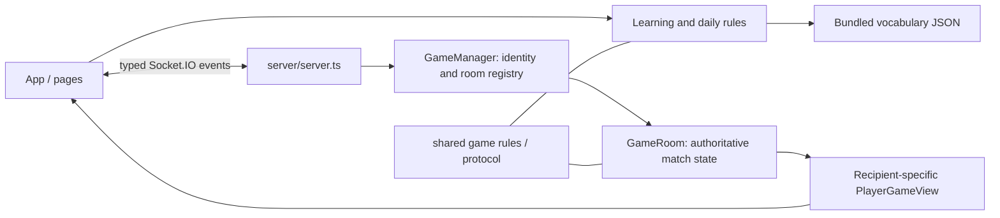

# Architecture

## Runtime and entry points

Penjat is a React 19/Vite 8 TypeScript SPA and a Node HTTP service with Socket.IO 4. There is no Express, router library, database, global state library or runtime vocabulary API. `src/main.tsx` mounts `App` in StrictMode. `src/routing.ts` normalizes paths; `App.tsx` manages browser history, modes, interface/game language, room snapshots, chat and exit confirmation. Routes: `/`, `/multijugador/`, `/aprendre/`, `/paraula-del-dia/`, `/com-es-juga/`.

`server/server.ts` serves `dist/`, route-specific SEO metadata, legacy Spanish redirects, `/health`, room previews at `/api/rooms/:code/preview`, and Socket.IO. Development uses Vite plus the separate server; production serves both on one origin. There is no service worker or backend persistence. `render.yaml`, README and package scripts describe single-process hosting; deployment is outside routine verification.

## Ownership and boundaries

| State | Owner | Lifetime |
| --- | --- | --- |
| Learning round, attempt history, summary | `LearningPage`, pure `learning/game.ts` rules | Mounted page only |
| Daily round | `DailyChallengePage`, `daily/game.ts` | Replayed from local storage for current Madrid date |
| Homepage daily summary (number, won/lost, mistakes) | `HomePage`, pure `daily/homeSummary.ts` | Re-read on mount, focus, storage events and each minute; never shows the word |
| Match, score, turn roster, forgiveness, secret word | `GameRoom` | Server process / room |
| Identity → room/socket mappings | `GameManager` | Server process |
| Disconnect timers | `server.ts` | 25 seconds after socket loss |
| Room view, chat display, typing display | `App` | Current client |
| Name, languages, selected learning level | `localStorage` | Browser origin |
| Room code/player ID/reconnect token | `sessionStorage` | Tab session (can be copied by browser tab duplication/opener) |

Clients send intent (`game:guess`, `round:set-word`, etc.). Server resolves socket identity, validates, mutates `GameRoom`, acknowledges and broadcasts individually serialized `viewFor(playerId)` snapshots. Guessers never receive the active secret word or other players' private progress; setter observation receives a selected board and setter-only forgiveness requests. Chat uses separate events and a bounded in-memory history of 50 messages. Completion retains the room for rematches; explicit departure or expired reconnect grace removes membership, deleting the room when no active members remain.

## Vocabulary and local game logic

`learning/vocabulary.ts` validates the bundled 544-entry `data/vocabulary.json`. `learning/game.ts` filters CEFR metadata: basic=A1/A2, intermediate=B1/B2, advanced=C1/C2, all=classified entries. The legacy `difficulty` field is distinct. Selection favors unseen words, permits failed-word review after a cooldown and falls back within the selected pool. Daily mode resolves a fixed 32-ID ordered pool against the same dataset; day index from the Madrid date and fixed epoch selects the word.

The offline Python pipeline is in `scripts/vocab_pipeline.py`, with small command wrappers. Source/license and review provenance live in `data/README.md`; approved baseline is `docs/vocabulary-v1.md`. Experiments under `data/experiments/` are ignored and must not become runtime dependencies. Reviewed metadata is merged by stable ID using `data/review/linguistic-metadata.json`. Ordinary builds never call external APIs.

`shared/game.ts` is the active shared normalization/matching implementation. Older `src/game/game.ts` and word lists remain; inspect callers before reusing them. Learning and daily rules are similar but have different session/persistence lifecycles.

## Persistence and limits

Daily storage (`penjat-daily-challenge`) stores one date's guesses/result; restore (including the homepage summary) reconstructs the round from guesses, not trusted score flags. Learning history/stats are not persisted; `penjat-learning-cefr` is a preference only. Interface preference is separate from `hangman-game-language`; multiplayer name uses `hangman-name`. Room credentials use `hangman-room-session` in session storage. No accounts or cross-device saves exist. Restarting the server loses all rooms; multiple replicas cannot share state.

## Incremental concerns

- `App` combines routing, socket subscriptions, restoration and metadata. Extract a small session coordinator only when further lifecycle work requires it; keep recipient views as the UI boundary.
- `GameRoom` combines game state and chat; avoid large refactors until contracts cover the proposed separation.
- Offline artifacts and runtime metadata can drift. Add coverage checks before considering pipeline restructuring; do not blindly rebuild approved lexical data from older inputs.
- UI metadata and HTTP SEO metadata are duplicated; a shared route table is a future focused cleanup.
- Existing Socket.IO E2E tests exercise independent clients, not browsers, storage or navigation. See development docs for test isolation.
- The eager vocabulary import contributes to the existing >500 kB bundle warning; route-level code splitting is optional follow-up.
